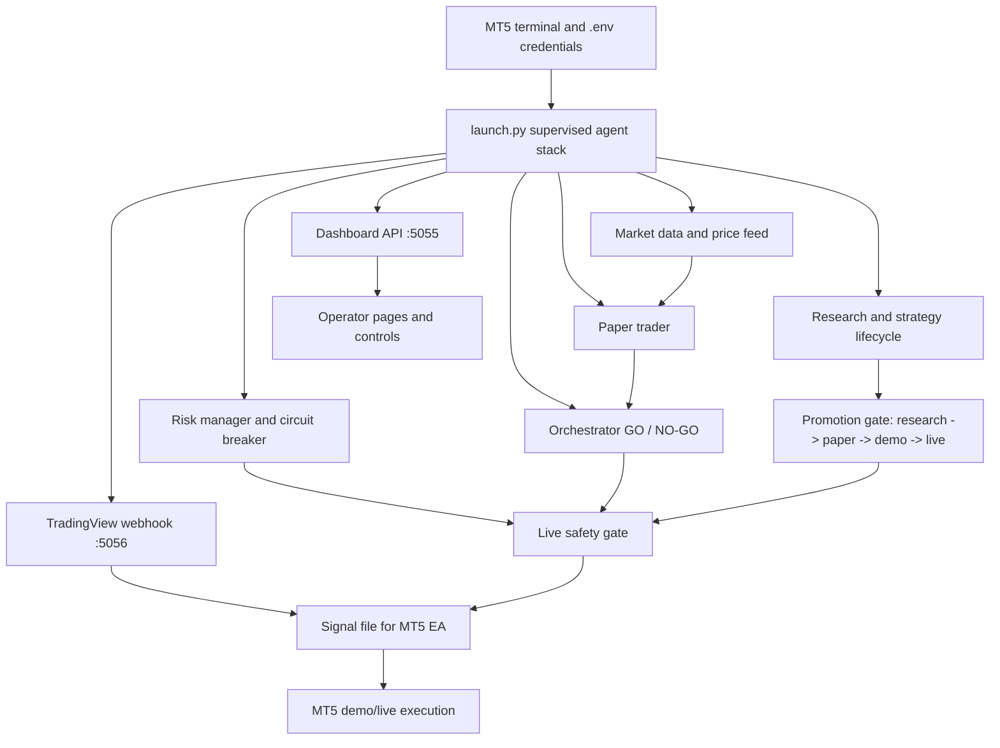
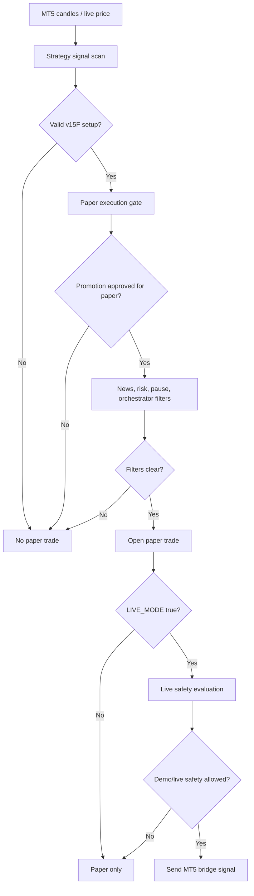
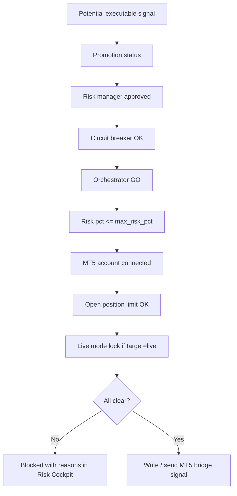
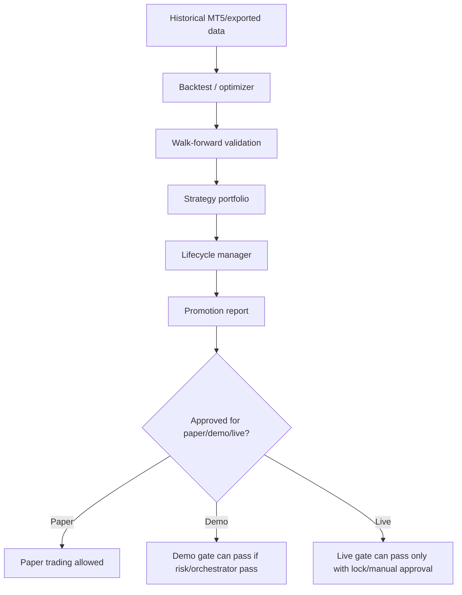

# MIRO Repo Flow Map

This file is the first place to read when you or another agent needs to understand how this autonomous trading repo works, why trades are or are not happening, and which files control each stage.

Important safety rule: the system may monitor MT5 and paper trade, but MT5/demo/live execution should remain blocked unless setup, promotion, risk, orchestrator, and live safety gates all pass.

## 1. Start Here

Run from the project root:

```powershell
cd "D:\Trading Project with Codex\MiroTrade-Autonomous-System"
.\run_dashboard.ps1
```

Main browser pages:

| Page | Purpose |
| --- | --- |
| `http://localhost:5055/` | Command Center / main overview |
| `http://localhost:5055/operator-map` | Plain-English flow and why no trades are happening |
| `http://localhost:5055/setup` | Environment, ports, runtime checks, safe repair actions |
| `http://localhost:5055/pipeline` | Pipeline gate state from data to execution |
| `http://localhost:5055/rules` | Manual rules and safety controls |
| `http://localhost:5055/risk-cockpit` | MT5 account, exposure, safety gates |
| `http://localhost:5055/scoreboard` | Paper account and paper trade metrics |
| `http://localhost:5055/strategy-lab` | Promotion, research, and strategy lifecycle |
| `http://localhost:5055/operations` | Start/stop/restart agents, watchdog, Telegram, locks |

Useful health commands:

```powershell
.\health_check.ps1
.\agent_control.ps1 status
Invoke-RestMethod http://localhost:5055/api/operator-flow
Invoke-RestMethod http://localhost:5055/api/risk-cockpit
Invoke-RestMethod http://localhost:5056/status
```

## 2. High-Level System Flow



## 3. Runtime Ownership

| Component | Source file | State/log files | What it does |
| --- | --- | --- | --- |
| Main launcher | `launch.py` | `logs/agents_supervisor.log`, `runtime/agents.pid` | Starts all major agents in one supervised process. |
| Supervisor controls | `tools/agent_supervisor.py` | `runtime/agent_supervisor.json` | Start/stop/restart agent stack, watchdog, and TradingView webhook. |
| Dashboard server | `agents/master_trader/miro_dashboard_server.py` | Serves `:5055` | UI pages and API endpoints for operations, setup, risk, pipeline, and maps. |
| Watchdog | `tools/watchdog.py` | `runtime/watchdog.pid`, `logs/watchdog.log` | Health monitor and recovery loop. |
| Telegram commands | `agents/master_trader/telegram_commands.py` | `runtime/telegram_command_announce.json` | `/status`, `/pause`, `/resume`, `/closeall`, `/help`; startup alert is throttled. |
| Telegram routing | `tools/telegram_router.py` | Telegram control/digest files | Mute, digest, category routing, and notification grouping. |

If the dashboard looks stale, check for duplicate `launch.py` processes:

```powershell
Get-CimInstance Win32_Process | Where-Object { $_.CommandLine -match 'launch.py' } | Select-Object ProcessId,CommandLine
```

Only one `launch.py` should normally be running.

## 4. Trading Decision Flow



Key paper files:

| File | Role |
| --- | --- |
| `paper_trading/simulator/paper_trader.py` | Scans v15F H1/M5, opens/closes paper trades, optionally mirrors to MT5 only when `LIVE_MODE=true` and live safety allows. |
| `paper_trading/logs/state.json` | Paper account state. Must stay separate from MT5 live balance. |
| `strategies/scalper_v15/` | v15F strategy and backtest implementation. |

## 5. MT5 / Demo / Live Execution Flow



Key execution files:

| File | Role |
| --- | --- |
| `live_execution/safety.py` | Final safety gate for demo/live execution. |
| `live_execution/live_safety_config.json` | Local runtime config for safety gates. Do not casually commit secrets or personal runtime changes. |
| `live_execution/bridge/mt5_bridge.py` | Python bridge that sends signals to MT5. |
| `live_execution/mql5/SignalBridgeEA.mq5` | MT5 EA reads `mirotrade_signal.json` from MT5 Common Files. |
| `tradingview/webhook_server.py` | Receives TradingView alerts on `localhost:5056`. |
| `tradingview/bridge_launcher.py` | Optional ngrok/public webhook launcher. |

Safe webhook test:

```powershell
Invoke-RestMethod "http://localhost:5056/test?action=BUY&price=4600"
```

This endpoint is test-only and should not trigger the EA.

## 6. Why No Trades Checklist

Use this order. It avoids guessing.

| Check | Command / Page | What to look for |
| --- | --- | --- |
| Setup health | `/setup` or `Invoke-RestMethod http://localhost:5055/api/setup-wizard` | Score near 100, no blockers. |
| Operator flow | `/operator-map` or `/api/operator-flow` | `why_no_trades` tells the direct reason. |
| Paper account | `/scoreboard` | Paper balance, open trades, closed trades. |
| Orchestrator | `/pipeline` | Must be `GO` for normal execution. |
| MT5 safety | `/risk-cockpit` | `live_safety.allowed` must be true for demo/live. |
| Promotion | `/strategy-lab` or `/api/promotion` | Paper/demo/live stage. |
| Logs | `logs/agents_supervisor.log` | Startup errors, API quota errors, ngrok errors, agent crashes. |

Common blockers:

| Blocker | Meaning | Normal fix |
| --- | --- | --- |
| `MTF: Neutral - timeframes not aligned` | Orchestrator is correctly waiting. | Wait for alignment or tune strategy/rules in paper mode. |
| `Promotion stage is below demo approval` | Strategy is not approved for MT5 demo. | Run/collect paper and walk-forward evidence, then promote intentionally. |
| `Requested risk exceeds live safety cap` | Risk manager wants more than `max_risk_pct`. | Reduce risk or increase cap only for demo testing after review. |
| `OpenAI quota` / `Claude credit low` | AI calls are failing. | System falls back where possible, but AI analysis quality is reduced. |
| `ngrok session limit` | Too many ngrok sessions are active. | Stop old ngrok sessions or disable mobile tunnel if not needed. |

## 7. Research And Promotion Flow



Key research files:

| File | Role |
| --- | --- |
| `backtesting/research/promotion.py` | Promotion state and manual override logic. |
| `backtesting/research/lifecycle_manager.py` | Strategy lifecycle transitions. |
| `backtesting/research/autonomous_discovery.py` | Discovers/evaluates candidate strategies. |
| `backtesting/reports/strategy_lifecycle.json` | Current lifecycle state. |
| `backtesting/reports/promotion_status.json` | Current approval state. |
| `backtesting/data/` | Historical datasets required by research. |

If discovery says dataset is missing, export MT5 candles first:

```powershell
python backtesting\data\export_mt5_data.py --symbol XAUUSD --timeframe M5 --days 365
```

## 8. Override Map

Overrides are powerful. Prefer paper first, demo second, live last.

| Override area | API / UI | Risk |
| --- | --- | --- |
| Paper promotion | `/strategy-lab`, `POST /api/promotion` stage `paper_approved` | Low; paper only. |
| Demo promotion | `POST /api/promotion` stage `demo_approved` | Medium; can allow MT5 demo if other gates pass. |
| Live safety config | `POST /api/live-safety` | High; can bypass important protections. |
| Live lock | `/operations`, `POST /api/live-lock` | High; only affects live target, not demo. |
| Rules toggles | `/rules` | Medium/high depending on which gate is disabled. |
| Kill switch | `/operations` or `/setup` | Safety action; stops/locks system. |

Example: inspect live safety without changing it:

```powershell
Invoke-RestMethod http://localhost:5055/api/live-safety
```

Example: safe paper-only promotion review:

```powershell
Invoke-RestMethod http://localhost:5055/api/promotion
```

Do not disable `require_orchestrator_go`, `require_promotion`, or `require_risk_approved` for live trading unless you are intentionally running a controlled demo experiment and understand the exposure.

## 9. File And Folder Map

| Path | Meaning |
| --- | --- |
| `.env` | Local credentials and tokens. Do not commit. |
| `launch.py` | Main multi-agent runner. |
| `agents/` | Trading, risk, market, Telegram, orchestrator, and dashboard agents. |
| `paper_trading/` | Simulated trading engine and paper account logs. |
| `live_execution/` | MT5 bridge, safety, and MQL5 EA files. |
| `backtesting/` | Historical validation, optimization, strategy research, promotion reports. |
| `strategies/` | Strategy implementations and registry. |
| `tradingview/` | Webhook server, ngrok launcher, Pine/TradingView assets. |
| `tools/` | Supervisor, watchdog, reset, health, Telegram, operations utilities. |
| `runtime/` | Local PID/status/runtime controls. Do not treat as source of strategy truth. |
| `logs/` | Operational logs. Useful for debugging but can be huge. |
| `tests/` | Unit tests for safety, setup, promotion, and core behaviors. |

## 10. Agent Handoff Notes

When another agent takes over:

1. Read this file.
2. Run `git status --short` and do not overwrite uncommitted user/runtime changes.
3. Check `/api/operator-flow` before touching trading logic.
4. Keep paper balance separate from MT5 balance.
5. Keep live/demo execution blocked unless the user explicitly asks for a controlled override.
6. Run `python -m unittest discover tests` after code changes.
7. Do not commit `.env`, runtime secrets, or personal local account config.

